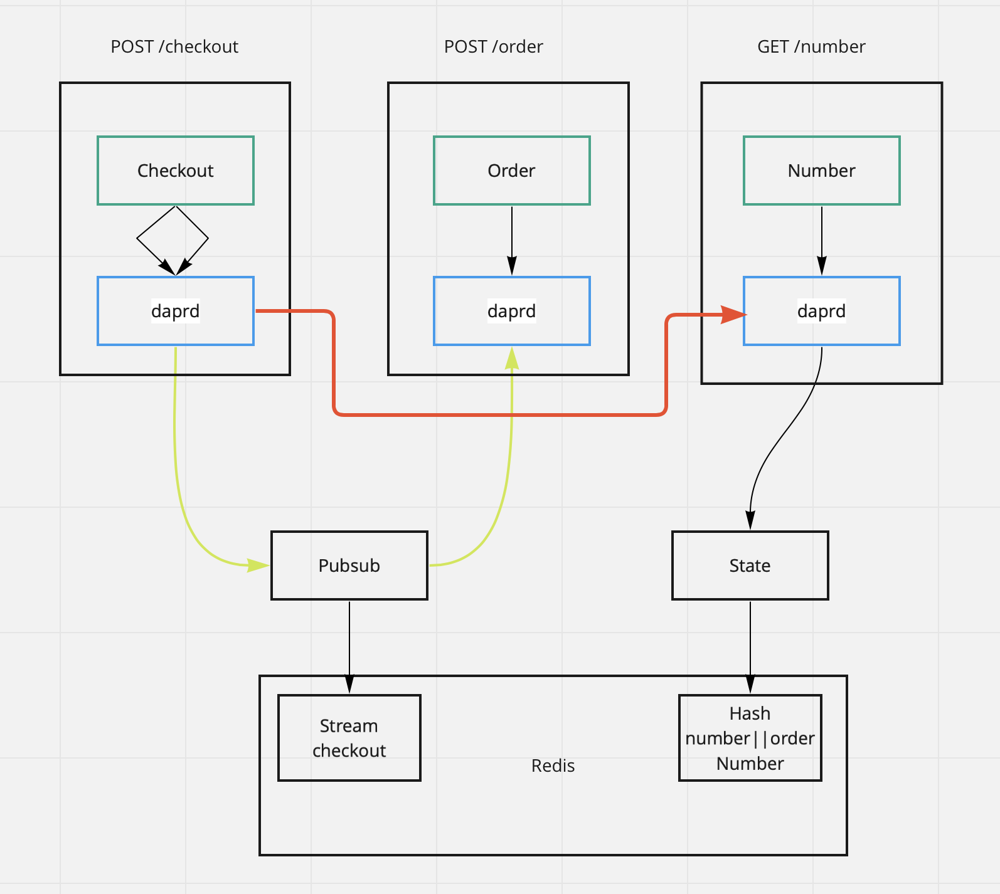
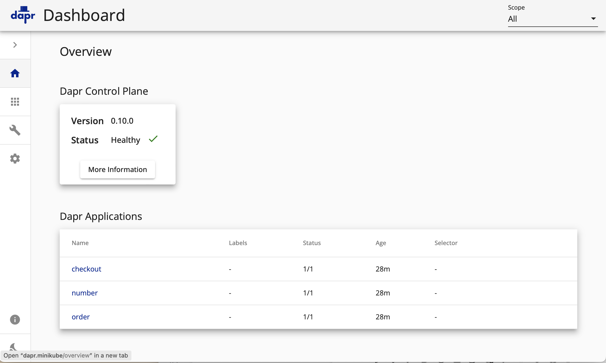
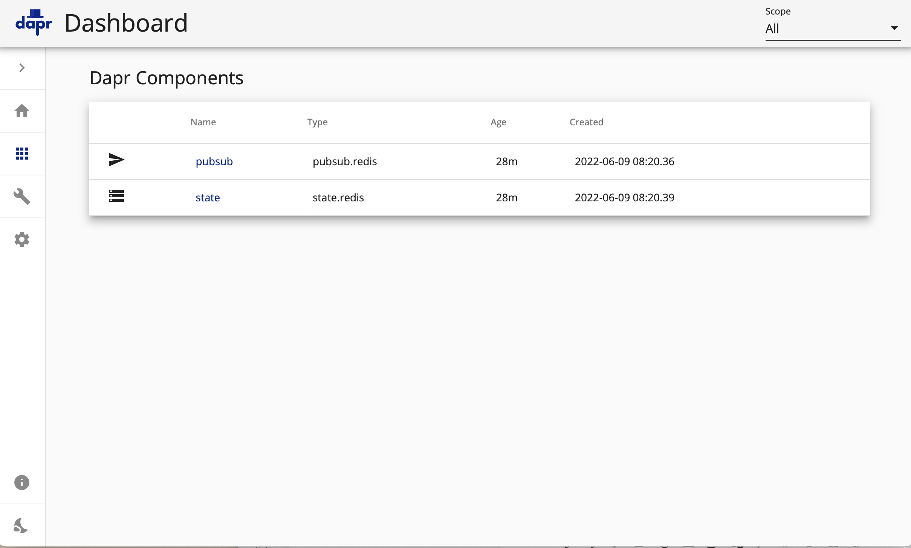

# demo
DAPR Demo application



## Installation

Configure and lauch minikube

```
minikube config set memory 8000
minikube config set cpus 4
minikube config set kubernetes-version 1.23.3
minikube start
```

Once minikube is running enable the ingress controller

```
minikube addons enable ingress-controller
```

Read out the IP address of minikube with

```
minikube ip
```

and write those entries to your /etc/hosts

```
<minikube-ip> dapr.minikube backend.minikube grafana.minikube prometheus.minikube
```

In the subdirectory terraform run terraform apply, but first only for the resources that create CRDs

```
terraform apply -target=helm_release.kube-prometheus-stack -target=helm_release.dapr-system
```

Then create everything else

```
terraform apply
```

This will install 

* DAPR in the namespace dapr-system
* The business services
* Monitoring

### DAPR

DAPR should be available under the http://dapr.minikube and show our services



and the following components



## Number

Number will return an incrementing number

```
curl http://backend.minikube/number
```

This call should return an incrementing value

## Checkout

Create a checkout. It does two things

* Call the number service to obtain a number
* Create a message to the topic checkout

```
curl -XPOST http://backend.minikube/checkout
```
 
## Order 

Subscribed to the topic checkout

```
curl http://backend.minikube/order
```

## Redis

Redis is used for the persistence

```
kubectl -n messaging exec -ti redis-master-0 -- redis-cli --pass redis keys \* 
```

### State

Redis is a state store

```
kubectl -n messaging exec -ti redis-master-0 -- redis-cli --pass redis hgetall 'number||orderNumber'
```

should return something like

```
1) "data"
2) "5"
3) "version"
4) "5"
```

### Stream

Streams are used for sending asynchrous messages.

```
kubectl -n messaging exec -ti redis-master-0 -- redis-cli --pass redis xrange checkout - +
```

should give you some output like

```
1) 1) "1654699830640-0"
   2) 1) "data"
      2) "{\"datacontenttype\":\"text/plain\",\"source\":\"checkout\",\"type\":\"com.dapr.event.sent\",\"tracestate\":\"\",\"traceparent\":\"00-22295cc10dd4eb53ae9879363d0e4943-11aac0459158b429-00\",\"data\":\"1\",\"id\":\"e20734c9-607d-4b11-94fd-bd735c43bea4\",\"specversion\":\"1.0\",\"topic\":\"checkout\",\"pubsubname\":\"pubsub\",\"traceid\":\"00-22295cc10dd4eb53ae9879363d0e4943-11aac0459158b429-00\"}"
2) 1) "1654699925789-0"
   2) 1) "data"
      2) "{\"data\":\"2\",\"source\":\"checkout\",\"pubsubname\":\"pubsub\",\"traceparent\":\"00-7644aab7b8b858c9f99883fe6f6b8b03-07930bba2d1eccc5-00\",\"tracestate\":\"\",\"topic\":\"checkout\",\"traceid\":\"00-7644aab7b8b858c9f99883fe6f6b8b03-07930bba2d1eccc5-00\",\"id\":\"763d3813-887c-4bc1-a50b-94a83f28cfbc\",\"specversion\":\"1.0\",\"datacontenttype\":\"text/plain\",\"type\":\"com.dapr.event.sent\"}"
```

## Tips

Restart all business services pods

```
kubectl -n backend get deployments | grep -v NAME | awk '{print $1}' | xargs kubectl -n backend rollout restart deployment
```
